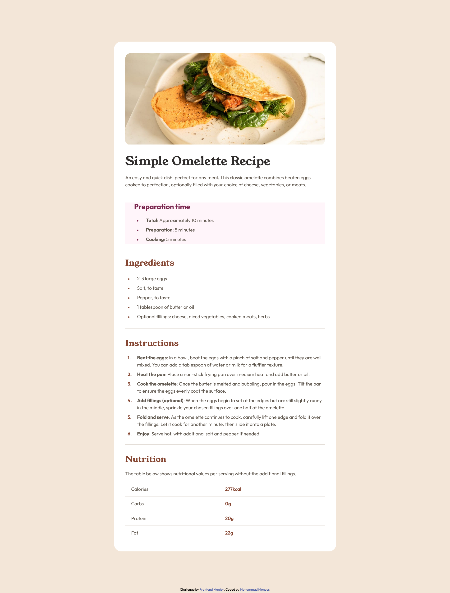
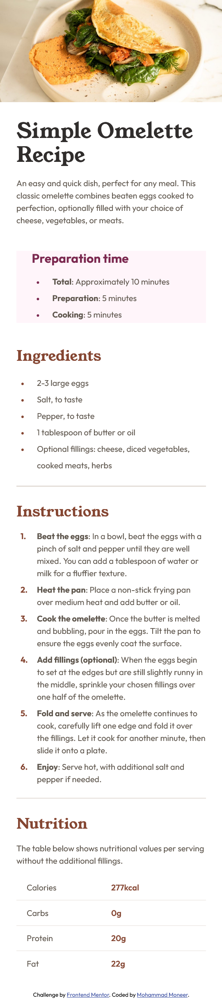

# Frontend Mentor - Recipe page solution

This is a solution to the [Recipe page challenge on Frontend Mentor](https://www.frontendmentor.io/challenges/recipe-page-KiTsR8QQKm). Frontend Mentor challenges help you improve your coding skills by building realistic projects. 

## Table of contents

- [Overview](#overview)
  - [Screenshot](#screenshot)
  - [Links](#links)
- [My process](#my-process)
  - [Built with](#built-with)
  - [What I learned](#what-i-learned)
- [Author](#author)

## Overview
To get some details and background of this project visit the link below:
[Frontend Mentor | Recipe Page coding challenge](https://www.frontendmentor.io/challenges/recipe-page-KiTsR8QQKm)

### Screenshot

### Links

- [GitHub Repository](https://github.com/Mohammad-Moneer/recipe-page)
- [Live Demo](https://mohammad-moneer.github.io/recipe-page/)

## My process

### Built with

- HTML
- CSS
- Flexbox

### What I learned

- More practice on semantic HTML.
- Structuring and styling tables.
- Generating content using pseudo-elements.
- Using CSS Counters

## Author

- Frontend Mentor - [@Mohammad-Moneer](https://www.frontendmentor.io/profile/Mohammad-Moneer)